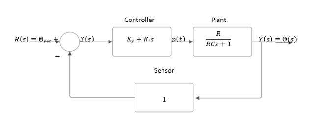
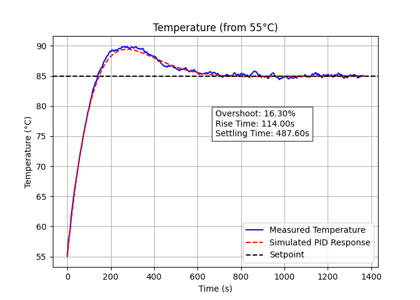

# Water Temperature Control System

**Amirkabir University of Technology (Tehran Polytechnic)**
*Department of Electrical Engineering*

<!-- 🖼️ IMAGE: Amirkabir University Logo -->


**Authors:**
* Keyvan Moaveni Nejad 

**Professor:**
Dr. Ahmad Afshar

**Date:**
February 2026 (Bahman 1404)

> **Note:** Artificial Intelligence was used in this project for proofreading, finding references, generating figures, and debugging code.

---

## 1. Introduction
The objective of this project is to investigate and practically implement linear control concepts on a real-world system. To this end, the dynamic behavior of the target system was first studied, and a mathematical model was extracted using experimental data and appropriate assumptions. This model serves as the foundation for the design and analysis of the controller.

Subsequently, based on the obtained model, a linear controller was designed, and its performance was evaluated in terms of stability, time response, and setpoint tracking accuracy. The designed controller was then practically implemented on the real system, and the practical results were compared with theoretical predictions. This comparison allows for the evaluation of the model's validity, the assumptions made, and the practical implementation constraints.

Finally, the results are analyzed, and the challenges arising from noise, model uncertainties, and hardware limitations are discussed to clarify the gap between the theoretical model and the actual system behavior.

### 1.1 Objective
We aim to maintain the water temperature in a coffee vending machine at a setpoint (e.g., 85°C) such that:
1. Extraction quality remains consistent.
2. Safety is maintained; the water temperature should not approach the boiling point.
3. System response is repeatable and predictable (not random or unstable).

### 1.2 Why is Closed-Loop Control Necessary?
In open-loop mode (e.g., turning on the heater with constant power), the water temperature fluctuates due to disturbances such as:
* Inflow of cold water
* Ambient temperature changes
* Sequential consumption by users
* Changes in heat exchange with the enclosure body

Therefore, the actual output temperature must be measured, compared with the reference setpoint, and the heater power adjusted accordingly.

### 1.3 Control Loop Components
* **Plant:** Water + Enclosure + Heater + Heat exchange with the environment
* **Control Input:** Heater power (Power Ratio)
* **Output:** Water temperature
* **Sensor:** NTC
* **Controller:** Digital (Arduino)
* **Actuator:** SSR (Solid State Relay for AC switching)

---

## 2. Physical Modeling of the Thermal System

**General Assumptions:**
The system consists of a 1-liter water container heated by an electrical heater, exchanging heat with the surrounding environment.
For simplicity in modeling, the water temperature is assumed to be uniform. Thermal properties of water are considered constant across different temperatures. Heat loss is modeled as purely dependent on the temperature difference between the water and the environment. The heat capacity of the system is approximated as the heat capacity of the water alone, ignoring the container and heater heat capacities. The heater directly produces thermal power.
These assumptions were chosen with an awareness of their limitations, aiming to achieve a minimal yet adequate model for linear control design.

### 2.1 Defining the Relative Temperature Variable
To simplify, we define the temperature difference relative to the environment:
```math
\theta(t) = T(t) - T_{amb}
```

This provides two advantages:
1. The effect of the environment, which acts as a disturbance, is neatly separated in the model.
2. Steady-state analysis becomes simpler because in steady-state, $\theta$ usually reaches a constant value.

### 2.2 Energy Balance
**Physical Principle:** Rate of change of system internal energy = Input power - Power lost to the environment

1. The internal energy of the water is modeled with an equivalent heat capacity $C$. The rate of energy change is $\approx C \frac{dT(t)}{dt}$
2. Let $P(t)$ be the input heater power. Considering efficiency $\eta=1$, the effective input power is $P(t)$.
3. Heat loss to the environment is modeled linearly (Thermal Resistance model $R$): $Q_{loss} = \frac{T(t) - T_{amb}}{R}$
4. Therefore: 
   ```math
    C\frac{dT(t)}{dt} = \eta P(t) - \frac{T(t) - T_{amb}}{R}
   ```
5. Using $\eta=1$ and $\theta(t) = T(t) - T_{amb}$ (assuming $T_{amb}$ is constant over short intervals, so $\frac{d\theta}{dt} = \frac{dT}{dt}$):
   ```math
    C\frac{d\theta(t)}{dt} = P(t) - \frac{\theta(t)}{R}
   ```

### 2.3 Transfer Function Extraction
Taking the Laplace transform (assuming zero initial conditions):
```math
Cs \Theta(s) = P(s) - \frac{1}{R}\Theta(s)
```
```math
Cs \Theta(s) + \frac{1}{R}\Theta(s) = P(s)
```
```math
\Theta(s)(Cs + \frac{1}{R}) = P(s) 
```
```math
\frac{\Theta(s)}{P(s)} = \frac{1}{Cs + \frac{1}{R}} = \frac{R}{RCs + 1}
```

The plant transfer function is:
$$ G_p(s) = \frac{R}{RCs + 1} $$
This is a first-order system with a time constant $\tau = RC$. If $R$ or $C$ increases, the system becomes slower.

### 2.4 Adding Controller and Feedback

<!-- 🖼️ IMAGE: Closed-loop block diagram -->


To control the system temperature and track the setpoint, a PI controller is initially used. The closed-loop transfer function is:
```math
\frac{\Theta(s)}{\Theta_{set}} = \frac{R(K_p s + K_i)}{RCs^2 + (1 + RK_p)s + RK_i}
```

---

## 3. Hardware Structure and Temperature Measurement
An electrical heater with a nominal power of 1500W is used as the thermal actuator. Power is applied discontinuously via a Solid State Relay (SSR), allowing high-power AC load switching with a low-power control signal. 
The controller is implemented on an Arduino microcontroller. Due to the digital nature of the SSR, a Time Proportional Control method is used with a fixed 2.5-second time window.

### 3.1 Connection Schematic

<!-- 🖼️ IMAGE: Practical circuit schematic of the temperature control system (Figure 3-1) -->


* Figure 3-1: Practical circuit schematic. The Arduino reads the temperature via the NTC voltage divider and commands the SSR via a digital output to switch the AC heater.

### 3.2 NTC Sensor and Resistance-to-Temperature Conversion
NTC implies resistance drops as temperature rises. The Beta model is used:
```math
R(T) = R_0 e^{\beta (\frac{1}{T} - \frac{1}{T_0})}
```
Solving for $T$ (in Kelvin):
```math
T = \frac{1}{\frac{1}{T_0} + (\frac{1}{\beta})\ln(\frac{R_T}{R_0})}
```
Conversion to Celsius:
```math
T_c = T - 273.15
```
Voltage Divider relations to calculate $R_{NTC}$:
```math
V_{out} = V_{cc}\frac{R_{NTC}}{R_{fixed} + R_{NTC}} \Rightarrow R_{NTC} = R_{fixed}\frac{V_{out}}{V_{cc} - V_{out}}
```
ADC to Voltage:
```mathV_{out} = \frac{ADC}{1023}V_{cc}
```

### 3.3 Hardware Constraints and SSR Switching Considerations
To ensure reliable SSR operation and equipment longevity, a minimum on/off time constraint of 250ms is enforced within every 2.5-second time window. This prevents ultra-fast pulsing, maintaining smooth control without damaging hardware.

---

## 4. Parameter Estimation (Thermal Resistance $R$ and Heat Capacity $C$)
To accurately design the controller, parameters cannot rely solely on theoretical values.

### 4.1 Calculating C
Assuming a 1-liter water volume:
```math
C = mc \Rightarrow C = 1 \times 4186 = 4186 \, (J/K)
```

### 4.2 Estimating R
Thermal resistance $R$ ($^\circ C/W$) represents insulation. 
Extracting $R$ from the energy balance:
```math
R = \frac{T - T_{amb}}{P(t) - C\frac{dT}{dt}}
``` 
By applying constant power (1500W) and recording temperature every 0.5s, $R$ can be estimated. However, taking the derivative ($\frac{dT}{dt}$) of noisy temperature measurements heavily amplifies the noise.

#### 4.2.2 The Noise Issue

<!-- 🖼️ IMAGE: Estimated Thermal Resistance without filter (Figure 4-1) -->


* Figure 4-1: Due to sensor noise, the raw $R$ estimation is highly scattered and contains severe outliers.

#### 4.2.3 The Solution (Savitzky-Golay Filter)
To solve this, a Savitzky-Golay digital filter was used in Python (`savgol_filter`) to smooth the data before derivative calculation.

<!-- 🖼️ IMAGE: Estimated Thermal Resistance after low-pass filter (Figure 4-2) -->
.png)

* Figure 4-2: Estimation after applying the filter. The average reported value is $R \approx 0.4$.

Plugging the estimated parameters into the plant:
```math
G_p(s) = \frac{0.4(K_p s + K_i)}{1674.4 s^2 + (1 + 0.4 K_p)s + 0.4 K_i}
```

---

## 5. Controller Design

### 5.1 Design Objectives and Operational Constraints
#### 5.1.1 Preheat Logic
When the temperature is far below the setpoint, applying maximum power is optimal. If Setpoint=85°C, the heater runs at 100% until 55°C, after which the PI controller takes over. This reduces initial rise time and restricts the linear controller to the operational region where the error is smaller.

#### 5.1.2 Two Important Constraints
1. **Error cap ($e(t) \le 30^\circ C$):** Prevents the controller from saturating immediately, avoiding non-linear boiling conditions.
2. **Maximum $K_p = 50$:** At $e(0)=30$ and max power (1500W), $P(0) = K_p e(0) \Rightarrow K_p = 50$. Higher values cause harsh SSR switching due to sensor noise.

### 5.2 Classical PI Controller Design
Using $K_p = 50$, damping ratio $\zeta = 0.7$, we calculate $K_i \approx 0.3$.

<!-- 🖼️ IMAGE: PI controller step response (Classical method) (Figure 1-5 / 5-1) -->
.png)

* Figure 5-1: Simulated PI step response (Classical method). Rise Time = 109.1s, Settling Time = 501.2s, Overshoot = 14.76%.

#### 5.2.2 Practical Implementation of Classical PI

<!-- 🖼️ IMAGE: Practical implementation of PI controller (Figure 2-5 / 5-2) -->


* Figure 5-2: Practical performance of classically designed PI. The high overshoot and long settling time are undesirable for safety-critical thermal systems.

### 5.3 Controller Design via IMC Method
Internal Model Control (IMC) explicitly incorporates the plant model to cancel process dynamics and shape the response via a filter.

<!-- 🖼️ IMAGE: IMC Controller block diagram (Figure 3-5) -->


#### 5.3.1 IMC Controller Design and Equivalent PI
The IMC controller converts to an equivalent PI controller. Using $K_p = 50$, we derive:
```mathT_f = 83.72 \Rightarrow T_i = 1674.4 \Rightarrow K_i \approx 0.03
```

<!-- 🖼️ IMAGE: Finding PID parameters with IMC method (Table/Figure 5-4) -->


<!-- 🖼️ IMAGE: PI step response (IMC method) (Figure 5-5) -->


* Figure 5-5: Simulated PI step response (IMC method). Overshoot is virtually eliminated.

#### 5.3.2 Practical Implementation of IMC PI

<!-- 🖼️ IMAGE: Practical implementation of PI (IMC) (Figure 5-6) -->


* Figure 5-6: Practical performance of IMC-designed PI. Rise Time = 180.0s, Settling Time = 267.5s, Overshoot = -0.10%. 

<!-- 🖼️ IMAGE: Bode diagrams of designed systems (Figure 7-5 / 5-7) -->


* Figure 5-7: Bode plots show the IMC design has a larger Phase Margin, indicating greater stability.

---

## 6. Evaluating PID and Empirical Methods

### 6.1 Is the Derivative (D) Term Necessary?
For thermal systems, the D term (predictive braking) is generally unnecessary because the system is inherently slow. More importantly, derivative action amplifies high-frequency noise from the NTC sensor, causing erratic SSR switching.

### 6.2 Filtered Derivative (Dirty Derivative)
If a D term is needed, a low-pass filter must be added: $D(s) = K_d \frac{\omega_c s}{\omega_c + s}$.

<!-- 🖼️ IMAGE: Fast Fourier Transform of temperature sensor data (Figure 6-1) -->


* Figure 6-1: FFT analysis shows noise dominates at frequencies above 0.05 Hz.
The cutoff frequency was selected as $\omega_{sys} \approx 10 \omega_c$ to preserve real temperature changes while dampening noise. However, since the D term offered minimal improvement, the pure PID was not practically implemented.

### 6.3 Ziegler-Nichols Method
The Ziegler-Nichols tuning method often produces aggressive responses with high overshoot. Given the safety risks of water boiling and the difficulty of inducing stable oscillations (due to noise and the SSR), this method was deemed unsuitable for this project.

### 6.4 Final Controller Selection

| Controller | Overshoot | Settling Time | Noise Sensitivity | Suitability for Thermal System |
| :--- | :--- | :--- | :--- | :--- |
| **Classical PI** | High | High | Low | Average |
| **PID** | Average | Average | High | Poor |
| **IMC-PI** | Very Low | Low | Low | **Excellent** |

**Conclusion:** The PI controller tuned via the IMC method was selected as the final controller, offering the best trade-off between response speed, stability, zero steady-state error, and practical implementability.

---

## References
1. R. C. Dorf and R. H. Bishop, Modern Control Systems, 13th Edition, Pearson, 2017.
2. G. F. Franklin, J. D. Powell, and A. Emami-Naeini, Feedback Control of Dynamic Systems, 7th Edition, Pearson, 2015.
3. Åström, K. J., and Hägglund, T., PID Controllers: Theory, Design, and Tuning, 2nd Edition, ISA, 1995.
4. Ziegler, J. G., and Nichols, N. B., "Optimum Settings for Automatic Controllers," Transactions of the ASME, vol. 64, pp. 759-768, 1942.
5. Rivera, D. E., Morari, M., and Skogestad, S., "Internal Model Control: PID Controller Design," Industrial & Engineering Chemistry Process Design and Development, vol. 25, no. 1, pp. 252-265, 1986.
6. Savitzky, A., and Golay, M. J. E., "Smoothing and Differentiation of Data by Simplified Least Squares Procedures," Analytical Chemistry, vol. 36, no. 8, pp. 1627-1639, 1964.
7. Arduino Documentation, "Analog Input and PWM Output," Official Arduino Reference, 2024.
8. NTC Thermistor Datasheet, 100kΩ, Beta Model Parameters, Manufacturer Documentation.
9. MathWorks, "PID Controller Design and Tuning," MATLAB Control System Toolbox Documentation, 2024.
